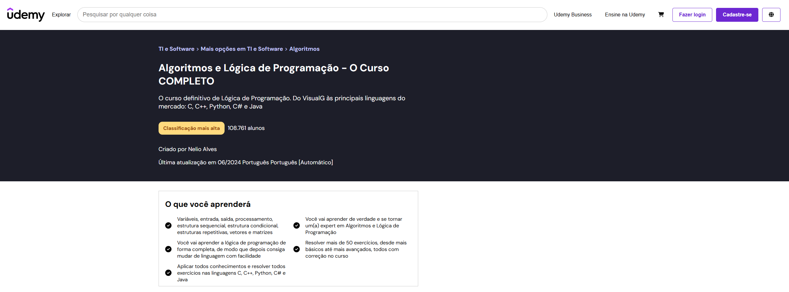

# Projeto: Remake de site/app web

Acesso: https://elc1090.github.io/project1-2025a-MartinRenz/

#### Desenvolvedor(a)
Mártin de Moura Renz - Sistemas de Informação UFSM

#### Cliente
Gustavo Araujo

#### Site/app original

##### Link
https://www.udemy.com/course/curso-algoritmos-logica-de-programacao/

##### Descrição
A Udemy é uma plataforma online de ensino que oferece uma ampla variedade de cursos, incluindo temas como programação, design e muitos outros. Com uma interface intuitiva e fácil de navegar, o site permite que os usuários adquiram conhecimentos tanto práticos quanto teóricos, de forma flexível e no seu próprio ritmo.

Para replicar a interface do site, utilizei HTML, CSS, JavaScript e React como framework. Criei uma página genérica chamada "Courses", projetada para acomodar uma variedade de cursos. Dentro desta página, desenvolvi componentes modulares que podem ser facilmente estendidos e reutilizados, garantindo escalabilidade e consistência na experiência do usuário.

#### Demanda do(a) cliente
A página /teaching do site da Udemy foi a escolhida para o remake.

Em relação à responsividade, rearranjar os elementos informativos sobre número de alunos, idiomas, inscrições, países e clientes empresariais, pode ser considerado um tamanho menor para a fonte no formato mobile, podendo variar de acordo com a criatividade do desenvolvedor.

Na seção 'Como começar', agrupar as diferentes abas na versão mobile, para manter o mesmo formato da versão desktop, no entanto para não ocupar espaço com o título das abas um ao lado do outro, criar um scroll horizontal que possibilite o acesso entre as abas 'Planeje sua grade curricular', 'Grave seu vídeo' e 'Lance seu curso'.

Por fim, torne os botões de inscrição 'Comece agora' mais chamativos.

#### Desenvolvimento
Neste projeto meu objetivo foi replicar a interface de cursos da Udemy, utilizando como tecnologias HTML, CSS, JavaScript, TypeScript, React e Vite.

Para o gerenciamento da interface, utilizei o React com TypeScript, para poder desenvolver uma interface pensando em componentes reutilizáveis.

A replicação da interface de cursos da Udemy envolveu a criação de diversos componentes modulares, como descrição, botões de ação, navbar, e outros.

#### Tecnologias

Substitua este trecho por uma lista detalhada de tecnologias usadas (tanto as básicas, como HTML e CSS, como as mais específicas, por exemplo Tailwind, etc.):
- HTML
- CSS
- Javascript
- React
- TypeScript
- Github Pages

#### Ambiente de desenvolvimento
- VS Code

#### Referências e créditos
- ChatGPT - Utilizei para desenvolvimento inicial do projeto, e criação de algumas funcionalidades dos componentes como o cronômetro utilizado em um componente.
- StackOverflow - Utilizei de muitos fórums para sanar dúvidas relacionadas a React e deploy no Github Pages. 

---
Projeto entregue para a disciplina de [Desenvolvimento de Software para a Web](http://github.com/andreainfufsm/elc1090-2025a) em 2025a
